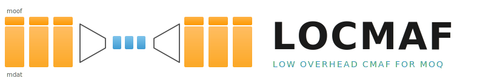

<p align="center">
  <picture>
    <source media="(prefers-color-scheme: dark)" srcset="assets/logo-dark.svg">
    <source media="(prefers-color-scheme: light)" srcset="assets/logo-light.svg">
    
  </picture>
</p>

# LOCMAF v0.2: Low Overhead CMAF for MOQ — working draft

**Document version:** 0.2-draft (work in progress)
**Wire-format `locmafVersion`:** `"0.2-draft"` (do not deploy)

This document is the working draft for LOCMAF v0.2. The frozen v0.1
specification at [LOCMAF.md](LOCMAF.md) remains authoritative for
deployed implementations. v0.2 is the basis for the first IETF
Internet-Draft submission, `draft-einarsson-moq-locmaf-00`, if and when
that cut happens. The LOCMAF document/wire version (`0.2`) and the
IETF draft submission number (`-00`, `-01`, …) advance independently;
the wire-format version follows the LOCMAF spec, the draft number
follows IETF submission cadence.

> **Status:** scaffolding. Sections marked _(TODO)_ need to be written;
> sections marked _(inherit from v0.1)_ carry over with at most minor
> editorial changes; sections marked _(changed)_ depart from v0.1 and
> explain how.

---

## What's new in v0.2

### Removed

- **Bespoke `moov` compression** (`MoovHeader = 21` in v0.1) — the
  per-box codec for the CMAF init segment is dropped entirely. v0.1's
  own measurements showed gzip handles codec-config-heavy moovs (HEVC
  VPS/SPS/PPS) at least as well as the bespoke codec, while the bespoke
  path costs ~500 lines of fragile, single-track-assuming code. v0.2
  treats the CMAF init segment as opaque bytes carried via the catalog,
  identical to what a plain CMAF track consumes.

### Added

- **`prft` (Producer Reference Time) round-trip** carried as fields
  *inside* the renamed chunk header (full or delta), with delta
  encoding against the in-group reference. No new top-level header ID.
  See [prft](#prft-producer-reference-time).
- **`emsg` (DASH Event Message) round-trip** carried as a
  length-prefixed list of records *inside* the chunk header. Sparse —
  most objects carry none. No new top-level header ID. See
  [emsg](#emsg-event-message).
- **`styp` carriage inside the full chunk header** (already implicit in
  v0.1 thinking, made explicit in v0.2). Absent from the delta chunk
  header, since CMAF only processes `styp` at the start of an
  addressable media object.
- **Explicit normative coverage of the per-fragment DRM box set**
  (`senc`, `saio`, `saiz`, `sgpd`, `sbgp`, `subs`, per-fragment `pssh`)
  in the chunk round-trip — v0.1 covered senc behaviourally but did
  not enumerate the others. See
  [DRM box round-trip](#drm-box-round-trip).
- **Compact 5-bit encoding for `sample_flags`** — IDR / P / B
  distinctions now ride in a single varint byte (down from ~4 B in
  v0.1) and survive zigzag delta encoding under the draft-17 MoQT
  varint scheme. See
  [Compact `sample_flags` encoding](#compact-sample_flags-encoding).
- **Optional CENC per-sample IV counter prediction.** Encoders MAY
  omit `moofInitializationVector` when the source follows the
  ISO/IEC 23001-7 counter rule; receivers MUST be able to derive the
  IV. Saves ~480–960 B/s on per-sample-IV CENC video. See
  [CENC IV counter prediction](#cenc-iv-counter-prediction-optional).
- **Publisher requirements** section listing source preconditions
  (single-`trak` moov, no mid-chunk KID change, BMDT contiguity,
  recommended commensurate timescales) and the optional strict-`cmf2`
  encoder mode. See [Publisher requirements](#publisher-requirements).
- **CMAF Ingest event-only track compatibility.** Sparse event-only
  CMAF tracks (DASH-IF Ingest sources with `sample_count = 0` chunks
  carrying `emsg` events) round-trip through LOCMAF without
  wire-format changes. See
  [Event-only tracks and CMAF Ingest compatibility](#event-only-tracks-and-cmaf-ingest-compatibility).

### Changed

- **Top-level header IDs renamed and consolidated.** v0.1's
  `MoofHeader = 23` becomes `LocmafFullHeader = 23`, and
  `MoofDeltaHeader = 25` becomes `LocmafDeltaHeader = 25`. The rename
  signals that one LOCMAF object now carries the *whole* CMAF chunk
  head — optional `styp`, optional `prft`, zero-or-more `emsg`, the
  `moof` — not just the `moof`. **There are exactly two top-level IDs
  in v0.2.** No separate object IDs for prft/emsg/styp/init/raw
  passthrough.
- **CMAF Header delivery** is via CMSF / MSF `initDataRefID` rather
  than per-track inline `initData`. A LOCMAF track and a plain CMAF
  track that wrap the same source media share one `initDataRefID`. The
  bytes are exactly the CMAF Header (uncompressed) — no
  LOCMAF-specific carrier. See
  [CMAF Header delivery](#cmaf-header-delivery). *(Dependent on
  pending MSF resolution of the `initDatas[]` / `initDataRefID`
  mechanism — see [Open dependencies](#open-dependencies).)*
- **`MoovHeader = 21` is retired.** No replacement object ID is needed.
- **Scope is narrowed to one CMAF track per MoQ track.** See
  [Scope: single CMAF track per MoQ
  track](#scope-single-cmaf-track-per-moq-track).
- **DRM-related boxes pruned to the minimum.** `sgpd`, `sbgp`, `subs`,
  and per-fragment `pssh` are not supported. KID changes MUST align
  with fragment boundaries; license-acquisition signalling goes via
  the catalog's `contentProtections` per CMAF §7.4.3. Image subtitles
  and sub-sample-using profiles are out of scope. Anything in this
  list that is needed requires plain CMAF packaging instead. See
  [Scope limits and fallback to plain
  CMAF](#scope-limits-and-fallback-to-plain-cmaf).
- **Field-ID space renumbered into tidy blocks.** Since there is no
  deployed v0.1 interop to preserve, the field IDs are reorganised:
  moof fields 1–16, prft fields 18 / 20 / 22 / 24 (track-ID derived
  from moov; flags added per ISO/IEC 14496-12), styp field 23 (no
  separate `minor_version` field — CMAF §7.2 mandates 0), emsg list
  25, deletion list 27. Concrete numbers are documented in the field
  reference tables.

### Removed

- **Raw CMAF chunk passthrough** (`RawChunkHeader = 33`) is not
  defined. v0.2 has no in-band escape hatch — content that exceeds the
  LOCMAF subset MUST be carried by a separate plain-CMAF track in the
  same catalog. Keeping the wire format minimal is more important than
  per-chunk encoder flexibility.

### Unchanged (carried over from v0.1)

- Object framing: varint `header_id` + varint `properties_length` +
  payload. Skip-unknown rule for forward extensibility.
- Moof delta codec algorithm (which fields, parity rule, derived BMDT,
  zigzag deltas). The renaming to `LocmafFullHeader` /
  `LocmafDeltaHeader` is a relabel, not a redesign — moof-only chunks
  (no styp/prft/emsg fields present) are wire-equivalent to v0.1
  modulo the renumbered field IDs.
- Mdat passthrough.
- Even/odd field-ID parity convention.
- MoQ group / object mapping: one MoQ group per CMAF segment, one MoQ
  object per CMAF chunk.

---

## Document outline

### Inherited from v0.1 with editorial updates

- **Background** _(inherit from v0.1)_
- **How MoQ groups map to CMAF** _(inherit from v0.1)_
- **Where LOCMAF wins: the moof delta stream** _(inherit from v0.1;
  retitled to "Where LOCMAF wins: the chunk delta stream" to match the
  renamed top-level objects)_
- **Scope: CMAF-shaped MP4 only** _(inherit from v0.1)_
- **Prerequisite: commensurate media timescales** _(inherit from v0.1)_
- **Media segment wire format** — object framing, two top-level header
  IDs (`LocmafFullHeader` / `LocmafDeltaHeader`), properties / field-
  tuple encoding, renumbered field-ID reference (moof 1–16, prft
  18/20/22/24, styp 23, emsg 25, deletion list 27), full vs delta chunk
  header rules, round-trip semantics _(inherited algorithmically from
  v0.1; field IDs renumbered, no MoovHeader)_

### Changed

- **CMSF catalog signalling** _(changed)_
- **CMAF Header delivery** _(changed — replaces v0.1's bespoke moov
  codec)_
- **Scope: single CMAF track per MoQ track** _(new — explicit
  restriction)_
- **DRM with LOCMAF** _(extended with explicit per-box round-trip
  table; pipeline diagram and cenc/cbcs measurements inherit from
  v0.1)_

### New

- **CMAF chunk structure** _(new — primer mapping CMAF boxes,
  chunks, fragments, and segments onto LOCMAF / MoQ)_
- **Segment Type Box (`styp`) and brand handling** _(new — fields
  inside `LocmafFullHeader`)_
- **prft (Producer Reference Time)** _(new — fields inside the chunk
  header, full or delta)_
- **emsg (Event Message)** _(new — length-prefixed record list inside
  the chunk header)_
- **DRM box round-trip** _(new — explicit normative table)_

### Replaced

- **Init segments: less critical, but still compressible** _(replaced —
  v0.1 §"Init segments" is replaced by the new "CMAF Header delivery"
  section that defers to CMSF/MSF dedup; bespoke init compression is
  removed)_

### Still relevant but updated

- **Forward extensibility** _(reduced — v0.2 retires the moov header
  ID, renames the two media header IDs, and reserves 27+ for future
  top-level kinds. No prft/emsg/raw-passthrough top-level IDs.)_
- **Possible improvements** _(prune: the prft section becomes
  normative; some items in v0.1 move into the body)_

---

## CMSF catalog signalling _(changed)_

A track that carries LOCMAF-encoded chunks signals:

```json
{
  "name": "...",
  "packaging": "locmaf",
  "locmafVersion": "0.2",
  "initDataRefID": "<refID into root-level initDatas[]>",
  "...": "..."
}
```

`initDataRefID` resolves to a `data` entry under the root-level
`initDatas[]` array (see [Init segment delivery](#init-segment-delivery)).
A `cmaf` packaging track and a `locmaf` packaging track wrapping the
same source MAY share an `initDataRefID`.

If the deployed CMSF / MSF catalog does not yet support
`initDatas[]` / `initDataRefID`, the inline `initData` field is used as
a fallback. New deployments SHOULD use the refID form.

> _(TODO: full normative wording, IANA registry pointer for
> `locmafVersion`.)_

---

## CMAF Header delivery _(changed)_

> **Terminology.** What CMAF calls the **CMAF Header** (§7.3.2.1 of
> ISO/IEC 23000-19) is the same artefact DASH and casual usage call an
> *init segment*, and is what MSF carries base64-encoded in the
> per-track `initData` field. This document uses **CMAF Header** as
> the primary term and refers to its catalog form as `initData`.

The CMAF Header for a LOCMAF track is **byte-identical to the CMAF
Header a plain CMAF track of the same source would carry** — `ftyp`
followed by `moov` followed by any optional supplemental boxes (`pssh`,
`meta`, `mvex` with `trex`, etc.). It is delivered **uncompressed** via
the catalog. There is no LOCMAF-specific CMAF Header carrier, no
LOCMAF-specific moov codec, and no per-Header wrapping.

The moov in the CMAF Header contains **exactly one `trak` box**. This
matches CMAF's general structure for both monoscopic media and
scalable codecs (see [Scope: single CMAF track per MoQ
track](#scope-single-cmaf-track-per-moq-track) and [Scalable codecs
and multi-track content](#scalable-codecs-and-multi-track-content)).

### Catalog binding

A LOCMAF track references its CMAF Header via the CMSF / MSF catalog,
either through `initDataRefID` into a root-level `initDatas[]` array
(when supported by the deployment — see
[moq-wg/msf#153](https://github.com/moq-wg/msf/issues/153)) or through
the inline `initData` string field as fallback.

Because the bytes are identical to a plain CMAF Header, **a `cmaf`
packaging track and a `locmaf` packaging track wrapping the same
source MAY share a single `initDataRefID`**. This is the key
catalog-side optimisation enabled by v0.2: one publisher serves both
legacy CMAF and LOCMAF-aware clients without duplicating the CMAF
Header.

```json
{
  "initDatas": [
    { "refID": "aac-stereo-128k", "data": "<base64 of CMAF init>" }
  ],
  "tracks": [
    { "name": "audio_cmaf",   "packaging": "cmaf",
      "locmafVersion": null, "initDataRefID": "aac-stereo-128k" },
    { "name": "audio_locmaf", "packaging": "locmaf",
      "locmafVersion": "0.2", "initDataRefID": "aac-stereo-128k" }
  ]
}
```

### Receiver responsibilities

A LOCMAF receiver:

1. Resolves `initDataRefID` (or reads inline `initData`) from the
   catalog.
2. Base64-decodes the CMAF Header bytes.
3. Feeds the bytes to its MSE / decoder pipeline exactly as it would
   for plain CMAF.
4. Begins receiving LOCMAF-encoded media objects on the subscribed
   track and reconstructs each CMAF chunk from the LOCMAF payload
   (or accepts it as-is when the object is a Raw CMAF chunk — see
   [Raw CMAF chunk passthrough](#raw-cmaf-chunk-passthrough)).

### Catalog-payload compression

Compression of the catalog itself (including its base64 CMAF Header
blobs) is **out of scope for LOCMAF** and handled at the MoQ / MSF
layer ([moq-wg/msf#144](https://github.com/moq-wg/msf/issues/144)).
The LOCMAF wire format does not see compressed catalog bytes; it sees
the already-decoded JSON catalog provided by the MSF reader.

---

## Scope: single CMAF track per MoQ track _(new)_

v0.2 restricts itself to the **one CMAF track per MoQ track** model:

- The CMAF Header (catalog `initData`) for a LOCMAF track MUST contain
  exactly one `trak` box in its moov.
- Each MoQ track carries the media for exactly that one CMAF track.

This is the standard CMAF arrangement — even Annex H's Scalable HEVC
profile carries base layer and enhancement layer as **separate CMAF
tracks**, each containing exactly one ISO BMFF track with a distinct
`track_ID`. There is no CMAF case that requires multiple `trak` boxes
within a single moov.

Multi-track ISO BMFF files (multiple `trak` boxes in one moov, the
classic .mp4 packaging pattern) are explicitly out of LOCMAF's scope.
Publishers carrying such files MUST demux them into one CMAF
track per MoQ track before LOCMAF encoding.

Future versions MAY relax this restriction if a concrete use case
emerges, but doing so would require a new mechanism for signalling
which `trak` a given MoQ object belongs to. v0.2 deliberately closes
that door to keep the wire format minimal.

---

## Scope limits and fallback to plain CMAF _(new)_

LOCMAF v0.2 targets the **low-latency CMAF** case: short fragments,
one or a few samples per chunk, with the moof codec optimising the
common case to a per-object overhead of ~2 bytes (see v0.1 §"Where
LOCMAF wins"). To keep the wire format minimal and the moof codec
implementable in a small amount of code, v0.2 deliberately does not
attempt to cover every legal CMAF construct.

The supported subset is:

- One CMAF track per MoQ track (see previous section).
- Per-fragment encryption metadata: `senc`, `saio`, `saiz`. CENC
  schemes `cenc` and `cbcs` only. Track-level `tenc` defaults are
  carried via the CMAF Header.
- No change of key identifier (KID) within a single CMAF chunk. KID
  changes MUST align with fragment (and therefore chunk) boundaries.
  This removes the need for `sgpd` / `sbgp` in the moof codec.
- No per-fragment `pssh`. DRM license-acquisition information is
  signalled in the catalog (CMSF `contentProtections`) per CMAF
  §7.4.3 and §8.2.2.3.
- No `subs` (sub-sample information). Image subtitles and other
  sub-sample-using profiles are out of scope; use plain CMAF for them.
- `prft` and `emsg` carried as fields *inside* the chunk header
  (`LocmafFullHeader` / `LocmafDeltaHeader`), not as separate
  top-level LOCMAF objects (covered in their own sections).
- One `moof` + one `mdat` per CMAF chunk, in the canonical CMAF order.

If a publisher needs to carry content that exceeds this subset —
for example, mid-fragment key rotation via `seig` sample groups,
multi-`trak` ISO BMFF files, or other less-common ISO BMFF boxes —
**the publisher SHOULD use plain CMAF packaging instead of LOCMAF**.
LOCMAF and plain CMAF tracks can coexist in the same catalog under
the same namespace; the publisher chooses per-track which packaging
to use based on what the source actually needs.

This is the guiding principle for what LOCMAF includes and excludes:
**if a CMAF feature is needed only by deployment scenarios outside
the low-latency live case, it belongs in plain CMAF, not in LOCMAF.**
LOCMAF is an optimisation for a specific operating point, not a
universal CMAF compressor.

### No raw CMAF chunk passthrough

v0.2 deliberately does **not** define an in-band escape hatch for
chunks the LOCMAF codec cannot express. The supported subset above is
the entire wire vocabulary; if a chunk falls outside it, the
publisher MUST carry the affected content on a separate plain-CMAF
track in the same catalog. LOCMAF and CMAF tracks coexist freely, and
the catalog already lets clients select per-track packaging.

This trades a small amount of per-chunk encoder flexibility for a
much simpler wire format and a cleaner Internet-Draft.

---

## Segment Type Box (`styp`) and brand handling _(new)_

### `ftyp` brands

The `ftyp` box lives in the CMAF Header and is carried verbatim via
the catalog. v0.2 does not transform or re-encode the `ftyp`. The
`major_brand`, `minor_version`, and `compatible_brands` list reach the
receiver exactly as the publisher wrote them. Nothing to do here.

### `styp` brands

The `styp` box sits at the top level of a CMAF chunk, preceding any
`prft`, `emsg`, or `moof` (CMAF Table 7). It signals the kind of
addressable boundary the chunk represents:

| Boundary the chunk represents     | Typical `major_brand` | Typical `compatible_brands`            |
|-----------------------------------|-----------------------|----------------------------------------|
| Start of a CMAF segment           | `cmfs`                | `cmff`, `cmfl`, `cmfr`, `cmfc`/`cmf2`  |
| Start of a CMAF fragment (mid-segment) | `cmff`           | `cmfl`, `cmfr`, `cmfc`/`cmf2`          |
| CMAF chunk only (mid-fragment)    | `cmfl`                | `cmfc`/`cmf2`                          |

A `styp` may additionally include `cmfr` in `compatible_brands` when
the chunk is a CMAF Random Access Chunk (CMAF §7.3.2.5), `cshl` when
the track conforms to Scalable HEVC (Annex H, Table H.1), and
`compatible_brands` from the CMAF Header's `ftyp` such as `iso9` /
`isoX` and `dash`.

Per CMAF §7.3.3.1 NOTE 3, a `styp` at the *start* of an addressable
media object is processed by the player; a `styp` *inside* an
addressable media object is ignored. LOCMAF reconstruction respects
this: the receiver synthesises a `styp` for each MoQ object only
where it matters, and the encoded form is correspondingly only
required at the boundary it describes.

CMAF §7.2 requires `minor_version` to be 0 for any structural CMAF
brand used as `major_brand`. The LOCMAF wire format relies on this:
`minor_version` is never encoded, and the reconstructor always emits
zero.

### Wire encoding

The `styp` payload is encoded as a **concatenated byte string of
4-byte brand codes**, ordered as `major_brand` followed by each
`compatible_brand` in order. Length is implicit from the LOCMAF
property's length field (must be a positive multiple of 4):

```
styp_data = major_brand (4 bytes)
          | compat_brand_1 (4 bytes)
          | compat_brand_2 (4 bytes)
          | ...
```

Reconstruction at the receiver:

```
styp box = box_size (4 bytes computed)
         | 'styp'   (4 bytes)
         | major_brand     (first 4 bytes of styp_data)
         | 0x00000000      (minor_version, always zero)
         | compatible_brands (remaining bytes of styp_data)
```

This saves 8 bytes per styp versus the raw box form (the box header
and the four zero bytes of `minor_version`), and avoids carrying any
field-tuple framing overhead inside the styp data itself.

### Where the styp data sits in a LOCMAF object

The `styp` payload is carried as a property field inside
**`LocmafFullHeader = 23`**. It is absent from `LocmafDeltaHeader = 25`,
because delta chunks only occur *inside* an addressable media object,
where any `styp` would be ignored by the CMAF processing rules.

Carrying the brand list as a chunk-header property (rather than a
separate top-level LOCMAF object) avoids the framing overhead of an
additional header. v0.2 does not allocate any separate top-level ID
for `styp`.

Field IDs assigned to `styp` inside the chunk header (parity rule:
odd = length-prefixed, even = scalar):

| ID | Symbol             | Kind          | Notes                                                    |
|----|--------------------|---------------|----------------------------------------------------------|
| 23 | `stypBrandList`    | raw bytes (odd) | Concatenation of 4-byte FourCC codes: `major_brand` followed by each `compatible_brand`. Length must be a positive multiple of 4. |

`styp.minor_version` is not carried on the wire — per CMAF §7.2 it
is 0 for any structural CMAF brand used as `major_brand`, so the
reconstructed value is always 0. (ID 24 is now used for
`prftFlags`.)

### Default brand list

If the encoder does not provide a `styp` field on a full moof, the
receiver synthesises one with the following defaults:

- `major_brand` = `cmfs`
- `compatible_brands` = `cmff`, `cmfl`, `cmfr` (if first-object SAP
  alignment is implicit), plus any structural brand recorded in the
  CMAF Header's `ftyp` (`cmfc` or `cmf2`)

This default matches the most common low-latency case (one MoQ group
per CMAF segment, group starts on a random access point). Encoders
that need a non-default brand list (e.g., to advertise `dash`
compatibility, or `cshl` for Scalable HEVC) MUST emit the styp field
explicitly.

---

## CMAF chunk structure _(new — primer for v0.2)_

LOCMAF carries CMAF media. To define what LOCMAF must preserve, this
section reproduces the relevant CMAF structural constraints from
ISO/IEC 23000-19:2023.

### Box layout of a CMAF chunk

A CMAF chunk (§7.3.2.3, Table 7) is the smallest CMAF addressable
media object. Its top-level box sequence is:

```
[styp]?  [prft]?  [emsg]*  moof  mdat
```

| Box   | Presence | Purpose                                                      |
|-------|----------|--------------------------------------------------------------|
| `styp`| 0 or 1   | Segment type — declares CMAF brand(s) and signals the start of an addressable media object. |
| `prft`| 0 or 1   | Producer Reference Time — wall-clock anchor tied to a media time. |
| `emsg`| 0 or more| DASH Event Message — sparse, opaque timed metadata.          |
| `moof`| exactly 1| Movie Fragment — sample metadata.                            |
| `mdat`| exactly 1| Media Data — coded samples.                                  |

Inside `moof` (Table 5):

```
moof
 ├── mfhd                     (1)
 ├── pssh                     (*)    per-fragment DRM payload
 └── traf                     (1)
      ├── tfhd                (1)
      ├── tfdt                (1)
      ├── trun                (1)
      ├── senc                (0/1)  per-sample IVs + subsample maps
      ├── saio                (CR)   pointers to senc bytes
      ├── saiz                (CR)   sizes of senc entries
      ├── sbgp                (*)    sample-to-group (seig for key rotation)
      ├── sgpd                (*)    sample group descriptions
      └── subs                (CR)   sub-sample info (im1i, CENC)
```

`tenc` (Track Encryption Box) lives in the CMAF Header (inside
`sinf` inside `stsd`) — never inside moof.

### From CMAF chunks to fragments to segments

CMAF defines three nested addressable units:

```
CMAF segment ───── one or more CMAF fragments in decode order
   └── CMAF fragment ─────── one or more CMAF chunks; first chunk starts with a SAP (random access)
          └── CMAF chunk ──── one moof + one mdat
```

- A **CMAF chunk** is one `moof` + one `mdat`. It can be referenced as
  an addressable media object on its own (§7.3.3.2).
- A **CMAF fragment** is one or more CMAF chunks. The first chunk in a
  fragment starts at a SAP type 1 or 2 (e.g. an IDR picture for AVC).
  All samples in a fragment share one `MovieFragmentBox`, but
  multi-chunk fragments split the media samples across multiple
  smaller `moof` + `mdat` pairs.
- A **CMAF segment** is one or more CMAF fragments in decode order.
  Segments are the typical unit of HTTP delivery in DASH / HLS-fMP4.

### Where styp / prft / emsg can appear

Per §7.3.2.4(c) and §7.3.3.1(c), a CMAF segment or fragment may
include `styp`, `prft`, and/or `emsg` boxes preceding its first
`MovieFragmentBox`. These boxes apply to the addressable media object
they sit at the start of.

NOTE 3 in §7.3.3.1 is load-bearing: a `styp` at the start of an
addressable media object is processed by players; a `styp` located
*inside* an addressable media object (i.e. preceding a non-first
`MovieFragmentBox`) is expected to be ignored. The same convention is
used for `prft` and `emsg`: producers may sprinkle them throughout, but
only those at the start of an addressable unit are guaranteed to be
processed.

### MoQ mapping for LOCMAF

v0.2 inherits v0.1's mapping:

| CMAF unit        | MoQ unit                                          |
|------------------|---------------------------------------------------|
| CMAF segment     | One MoQ group                                     |
| CMAF chunk       | One MoQ object (in MoQ-group decode order)        |
| CMAF fragment    | Spans one or more consecutive MoQ objects within a group, starting at a SAP |

The publisher chooses the CMAF segmentation policy (segment duration,
chunks per fragment). LOCMAF wraps whatever choice the encoder made.

### What LOCMAF compresses and what it does not

A LOCMAF chunk header — `LocmafFullHeader = 23` or
`LocmafDeltaHeader = 25` — carries the entire CMAF chunk *head* via
field tuples inside its property block, plus the unchanged `mdat`
payload that follows the property block.

| CMAF box             | LOCMAF treatment                                                                         |
|----------------------|------------------------------------------------------------------------------------------|
| `moof` (and `traf`)  | Compressed via the moof field IDs 1–16 inside the chunk header (full or delta).          |
| `mdat`               | Passed through verbatim, immediately following the chunk header's property block.        |
| `styp`               | Carried via field ID 23 inside `LocmafFullHeader` only. Absent from delta headers.       |
| `prft`               | Carried via field IDs 18, 20, 22, 24 inside the chunk header. Optional per chunk; delta-coded in delta headers. See [prft](#prft-producer-reference-time). |
| `emsg`               | Carried as a length-prefixed record list at field ID 25 inside the chunk header. No delta encoding. See [emsg](#emsg-event-message). |
| Per-fragment `pssh`  | Not supported. See [DRM box round-trip](#drm-box-round-trip).                            |
| `senc`, `saio`, `saiz` | Carried via the moof field IDs (existing v0.1 vocabulary, renumbered into the 1–16 block). See [DRM box round-trip](#drm-box-round-trip). |
| `sgpd`, `sbgp`, `subs` | Not supported. See [DRM box round-trip](#drm-box-round-trip).                          |

### styp omission

When a `LocmafFullHeader` carries no `stypBrandList` field, the
receiver emits **no** `styp` box in the reconstructed CMAF chunk.
CMAF (§7.3.3.1) does not require `styp` for decoding or playback —
players that need brand information consult the CMAF Header `ftyp`.
This avoids guessing at a default brand list and keeps the
reconstruction strictly faithful to what the encoder signalled.

Publishers that need a per-segment `styp` (e.g. advertising `dash`,
`cmfr` random-access, `cshl` Scalable HEVC) MUST emit the brand
list field explicitly on each `LocmafFullHeader`.

### Per-chunk vs per-fragment vs per-segment scope

Because CMAF allows `prft` / `emsg` at fragment-or-segment scope, the
publisher chooses when to emit them. v0.2 carries them on a
per-chunk-header basis — the same LOCMAF object that carries the
`moof` data also carries the `prft` / `emsg` data CMAF would have
placed at the same point in the byte stream.

For receivers that need fragment-or-segment-scoped views (e.g. to
reconstruct a byte-equivalent CMAF segment for downstream tooling),
the `prft` / `emsg` fields on `LocmafFullHeader` represent the
segment-level boxes; fields on `LocmafDeltaHeader` represent
chunk-level (or fragment-internal) boxes. Receivers MAY collate or
filter these per CMAF's processing rules (i.e. only the boxes at the
start of an addressable media object need to be preserved for player
consumption).

---

## prft (Producer Reference Time) _(new)_

CMAF places `ProducerReferenceTimeBox` at the top level of a CMAF
chunk, preceding `emsg` (if any) and `moof`, carrying an NTP-style
wall-clock anchor tied to a media-time (ISO/IEC 23000-19 §6.6.8,
§7.3.2.4). It enables end-to-end latency measurement and absolute-
clock alignment for live presentations.

v0.1 dropped `prft` silently. v0.2 carries it as **field tuples
inside the existing chunk header** — `LocmafFullHeader` for the first
object of a group, `LocmafDeltaHeader` for subsequent ones. There is
no separate top-level object kind for `prft`. Folding `prft` into the
chunk header (rather than allocating its own top-level ID) saves the
2-byte framing overhead of a sibling object on every chunk, which is
the bytes that matter for the per-object steady-state cost.

### Presence

`prft` is **optional per chunk**, signalled by the presence of `prft`
field IDs in the chunk header's property block. A receiver
reconstructs a `prft` box in the output CMAF chunk iff at least one
`prft` field appears.

This supports three producer patterns naturally:

1. **None** — never emit `prft` fields. Wire-equivalent to v0.1.
2. **Per-group** — emit full `prft` fields on the first object of
   each MoQ group only. Recommended for most live use cases.
3. **Per-object** — emit full `prft` fields on the first object,
   delta `prft` fields on subsequent objects in the group.
   Recommended when sub-group wall-clock resolution is needed.

### Field IDs

Within the chunk header's property block, `prft` occupies field IDs
18, 20, 22, and 24 (all even — scalar varint per the parity rule):

| ID | Symbol                | Source field                              | Kind     | Notes                                                          |
|----|-----------------------|-------------------------------------------|----------|----------------------------------------------------------------|
| 18 | `prftNtpTimestamp`    | `prft.ntp_timestamp` (NTP64 uint64)       | scalar   | Full chunk: absolute NTP64. Delta chunk: zigzag varint of `int64` delta against the in-group reference (see below). |
| 20 | `prftMediaTime`       | `prft.media_time`                         | scalar   | Full chunk: absolute media_time. Delta chunk: zigzag varint delta against the in-group reference.    |
| 22 | `prftVersion`         | `prft.version`                            | scalar   | Default 1 (uint64 media_time). Encoders SHOULD omit; receivers reconstruct 1 when absent. |
| 24 | `prftFlags`           | `prft.flags` (24-bit FullBox flags)       | scalar   | Default 0. Encoders MAY omit when 0; receivers reconstruct 0 when absent. Known ISO/IEC 14496-12 values: 0, 1, 2, 4, 8, 24. |

`prft.reference_track_ID` is NOT carried on the wire. The receiver
reconstructs it as the `track_ID` of the single `trak` in the CMAF
Header's `moov` (single-trak constraint already mandated by v0.2).

The in-group reference for delta encoding is the previous chunk in
the same MoQ group that carried `prft` fields. If the previous chunk
had no `prft`, the encoder MUST emit absolute fields on the current
chunk (i.e. treat it as a re-anchor).

### NTP64 delta is a plain 64-bit subtraction

NTP64 is layout-equivalent to a Q32.32 fixed-point seconds value
(integer seconds in the upper 32 bits, binary fraction in the lower
32 bits). Encoders and receivers MUST treat the field as a single
`uint64` for delta computation; the fraction/seconds carry at the
1-second boundary is absorbed by the natural 64-bit arithmetic:

```
encoder:  delta_i64 = (int64)(current_ntp64 - previous_ntp64)
          wire      = MoQT-varint(zigzag(delta_i64))

receiver: delta_i64 = unzigzag(MoQT-varint-decode(wire))
          current_ntp64 = previous_ntp64 + (uint64)delta_i64
```

The int64 range covers ±2³¹ seconds (±68 years) and the MoQT 8-byte
varint covers ±2²⁹ seconds (±17 years) of zigzag delta — enormous
headroom for any practical chunk-to-chunk gap.

### Steady-state byte cost

With per-object full-precision NTP, a delta chunk's `prft`
contribution is dominated by the NTP-fraction delta — ~4 B at common
frame rates (~85.9 M NTP units for 50 fps, ~171.8 M for 25 fps; the
zigzag value lands in the 4-byte varint band 16384..2³⁰−1).

LOCMAF v0.2 keeps full NTP64 precision rather than dropping to ms
or µs resolution, because sub-millisecond jitter around the mean
inter-chunk period is the **clock-drift detection** signal that
prft is most often used to observe. A coarser representation would
round it away. Encoders that don't need drift detection MAY choose
the per-group emission pattern (full `prft` on the first chunk
only) and avoid the 4 B per chunk entirely.

---

## emsg (Event Message) _(new — for CMAF source compatibility)_

CMAF inherits the DASH event message box (ISO/IEC 23009-1, CMAF
§7.4.5). In CMAF sources, `emsg` is sparse: most CMAF chunks carry
zero, occasional chunks carry one or more (ad markers, ID3, SCTE-35
via opaque `message_data[]`).

### Relationship to MSF `eventtimeline`

The MoQ-native mechanism for event metadata is the MSF
`eventtimeline` packaging (`draft-ietf-moq-msf-00` §5.1.13, §8): a
separate companion track that carries JSON event records and binds
back to the media timeline via wall-clock or MOQT location indexing.
CMSF inherits this mechanism — it does not define any in-band
`emsg` carriage of its own.

**New MoQ deployments SHOULD use a companion `eventtimeline` track**
for event metadata rather than inline `emsg`. LOCMAF's `emsg`
support exists solely so that publishers transcoding existing
DASH/CMAF content with inline `emsg` boxes can preserve those events
losslessly across the MoQ hop. When the publisher has freedom over
how the event metadata is packaged, `eventtimeline` is preferred:
it is the documented MoQ mechanism, it survives independently of the
media track, and it scales to large event archives without inflating
the per-media-chunk wire bytes.

A LOCMAF publisher MAY emit zero `emsg` records on every chunk and
deliver the same event metadata as a sibling `eventtimeline` track.
This is the recommended deployment pattern.

### Version 1 only

LOCMAF v0.2 carries **`emsg` version 1 exclusively**, following CMAF
§7.4.5 which mandates v1 for in-band CMAF event message boxes
("CMAF Event Message Boxes shall be version 1"). Version 0 `emsg`
boxes — the legacy DASH form that locates events with
`presentation_time_delta` relative to the enclosing
`MovieFragmentBox` rather than against `timescale` ticks — are not
supported by the LOCMAF wire format. A publisher whose source
contains version-0 `emsg` boxes either rewrites them to v1 before
LOCMAF encoding or uses plain CMAF packaging (or `eventtimeline`)
for that track.

The wire encoding therefore omits the `version` byte entirely; both
endpoints know the version is 1.

### Record placement

v0.2 carries `emsg` as **a length-prefixed list of records inside the
chunk header**, not as a separate top-level object. This keeps the
two-ID design and pays zero overhead on chunks that carry no events
(the field ID simply isn't present).

### Field ID

| ID | Symbol      | Kind                          | Notes |
|----|-------------|-------------------------------|-------|
| 25 | `emsgList`  | raw bytes (odd / length-prefixed) | A self-delimited concatenation of v1 `emsg` records, in CMAF order. The outer length prefix gives the total byte count; each record is parsed sequentially. |

No delta encoding for `emsg`. Each list is emitted whole. Events
rarely appear on more than a handful of consecutive chunks, and when
they do they usually carry distinct payloads, so a delta scheme would
not pay back its complexity.

### Record encoding

Each record inside `emsgList` is a compact form of the v1
`DASHEventMessageBox` (ISO/IEC 23009-1 §5.10.3.3) with two
integer-field compressions applied:

```
record = scheme_id_uri          (varint length + UTF-8 bytes)
       | value                  (varint length + UTF-8 bytes)
       | timescale              (varint; 0 means "use the track's mdhd.timescale")
       | presentation_time      (signed-or-unsigned varint — see below)
       | event_duration         (varint, in `timescale` ticks; 0 means "unknown duration" per the DASH spec)
       | id                     (varint)
       | message_data           (varint length + opaque bytes)
```

`reference_track_id` is implicit (the track this chunk belongs to).
`version` is implicit (1). The two strings are length-prefixed
instead of NUL-terminated.

#### `timescale` default

CMAF v1 `emsg.timescale` is the timescale in which
`presentation_time` and `event_duration` are expressed; it does not
have to match the track's `mdhd.timescale`, though in practice it
usually does.

A LOCMAF record encodes `timescale = 0` to mean "use the track's
`mdhd.timescale`." The value 0 is otherwise meaningless in a v1
`emsg` (ticks per second cannot be zero), so it is safely available
as a default-marker. Receivers reconstructing the v1 `emsg` box
write the track's `mdhd.timescale` into the `timescale` field when
the record carried 0.

Encoders MAY emit a non-zero `timescale` value when the source's
`emsg.timescale` actually differs from the track timescale.

#### `presentation_time` — two modes by timescale

CMAF v1 `emsg.presentation_time` is the absolute media time of the
event on the track's timeline, expressed in the record's
`timescale` ticks. LOCMAF encodes it in one of two modes, selected by
the record's `timescale` field:

**Mode A (track-timescale, delta encoding) — `timescale = 0`.** The
record's events share the track's timescale, so they live on the
same axis as the chunk's `moofBaseMediaDecodeTime` (BMDT). LOCMAF
carries `presentation_time` as a **signed zigzag varint delta
against the chunk's BMDT**, in track-timescale ticks:

```
emsg.presentation_time = chunk_bmdt + signed_delta
```

For events placed at the chunk's media time the delta is 0 (1 byte).
Small forward placements ("event takes effect 0.5 s from now") and
small backward placements (publishers who annotate events slightly
after the fact) both fit in 1–2 bytes. This is the common case and
the one the compression is designed for.

**Mode B (foreign timescale, absolute encoding) — `timescale ≠ 0`.**
When the record carries an explicit timescale different from the
track's, the BMDT and the event time are on different axes and a
cross-timescale delta would require both endpoints to perform a
timescale conversion. LOCMAF avoids that: in mode B the
`presentation_time` field is encoded as an **unsigned varint
absolute value**, exactly as in the source v1 `emsg` box (no delta).

The receiver discriminates by inspecting the record's `timescale`
field before parsing `presentation_time`. Mode A and mode B differ in
zigzag-vs-absolute encoding, but a decoder that has already read
`timescale` knows which to expect.

Most encoders will use mode A; mode B is a correctness path for
the rare case where event timing genuinely lives in a different
timescale from the media.

#### Future: per-track scheme dictionary

`scheme_id_uri` strings are 25–60 bytes each and tend to repeat
across all events on a track (a SCTE-35-only track, an ID3-only
track, etc.). A future revision MAY add a per-track scheme
dictionary in the CMSF catalog, replacing the string with a small
dictionary index inside `emsgList` records. v0.2 deliberately leaves
this out — emsg is sparse enough that the per-record string cost is
acceptable, and adding it touches CMSF rather than LOCMAF alone.

### Notes

For high-volume or post-hoc event streams (large VOD timeshift event
archives), publishers should consider MSF `eventtimeline` companion
tracks instead of inline `emsg`. The two mechanisms compose; LOCMAF
only addresses the inline case.

> _(TODO: confirm timescale source, finalize sizing notes, document
> alignment with the moqlivemock subtitle / event reference
> implementation.)_

---

## Event-only tracks and CMAF Ingest compatibility _(new)_

DASH-IF Ingest [DASH-IF-Ingest] defines a CMAF-based push interface
for live encoders. One of its track shapes is the **sparse
event-only track**: a CMAF track that carries no media samples (or
samples of zero size) and exists purely to deliver timed events via
`emsg` boxes attached to the chunks. Examples include SCTE-35 ad
markers, ID3-tagged metadata, and DASH application events.

LOCMAF v0.2 supports event-only tracks without any wire-format
extension. A publisher acting as a CMAF Ingest → MoQ gateway can
re-wrap these tracks using LOCMAF packaging exactly as it does
media tracks.

### What a LOCMAF event-only chunk looks like

A `LocmafFullHeader` for an event-only group:

```
LocmafFullHeader=23
properties_length
  moofSampleCount = 0
  moofBaseMediaDecodeTime = N  (absolute)
  emsgList = [v1 emsg records]
(empty mdat payload — properties consume the whole MoQ object)
```

A `LocmafDeltaHeader` for a subsequent event-only chunk:

```
LocmafDeltaHeader=25
properties_length
  moofBaseMediaDecodeTime = N'  (absolute override, see below)
  emsgList = [v1 emsg records]  (only when this chunk carries events)
(empty mdat payload)
```

A chunk that carries no events at all in a group full of events
collapses to the steady-state 2-byte `LocmafDeltaHeader` form, same
as a media-track no-op.

### BMDT advancement when there are no samples

The delta-chunk BMDT derivation rule is
`previous_bmdt + sum(previous_sample_durations)`. With
`sample_count = 0`, the sum is always 0 — the derived BMDT never
advances. That is mathematically valid (CMAF permits zero-duration
fragments) but almost never the intended semantics for an
event-only track. Encoders have two options:

1. **Absolute BMDT override per chunk.** The delta chunk header
   emits `moofBaseMediaDecodeTime` explicitly using the v0.1
   override mechanism (already part of the delta encoding). Costs
   ~2 B per chunk in addition to the framing floor. Recommended for
   pure event-only tracks, where the per-chunk overhead is amortised
   only against the event payload anyway.
2. **Synthetic per-chunk sample.** The encoder sets `sample_count = 1`
   with `default_sample_duration` equal to the desired per-chunk
   tick advancement and a zero-size sample. The trun describes a
   zero-byte sample, the mdat is empty, and BMDT derivation works
   without an override. This is also how CMAF Ingest commonly
   shapes sparse metadata tracks (`urim`, `stpp` sample entries).
   Receivers see a chunk with a single zero-length sample and emit
   nothing to the player pipeline — only the events matter.

Both are encoder-side decisions; the LOCMAF wire format is identical
in either case.

### Relationship to MSF `eventtimeline`

For new MoQ deployments, MSF `eventtimeline`
(`draft-ietf-moq-msf-00` §8) is the preferred mechanism for event
metadata: an independent companion track carrying JSON event
records, no media-chunk overhead, scalable to large event archives.
See [emsg](#emsg-event-message).

LOCMAF event-only tracks are the right answer when the publisher
is **transit-relaying CMAF Ingest content** unchanged across MoQ —
typically a packaging gateway that takes DASH-IF Ingest input and
republishes the same set of tracks via MoQ. The publisher MAY
re-shape inline events into an `eventtimeline` track at the gateway
boundary; if it doesn't, LOCMAF carries the original CMAF event
track losslessly.

### Single-`trak` requirement still applies

An event-only LOCMAF track is one CMAF track per MoQ track, like
any other LOCMAF track — the CMAF Header `moov` contains exactly one
`trak`. CMAF Ingest sources that bundle multiple event categories
into a single multi-`trak` file MUST be demuxed at the gateway into
one MoQ track per event category. See
[Scope: single CMAF track per MoQ track](#scope-single-cmaf-track-per-moq-track).

---

## DRM box round-trip _(new — explicit normative table)_

v0.1 documented `senc` survival behaviourally. v0.2 enumerates the
minimum set of per-fragment DRM boxes LOCMAF preserves, with two
explicit scope limits:

1. **No change of key identifier within a single CMAF chunk.** Streams
   that require mid-chunk key rotation MUST use plain CMAF packaging
   instead. This allows the v0.2 wire format to drop `sgpd` and `sbgp`
   entirely.
2. **No per-fragment `pssh` in the moof.** Following CMAF §7.4.3 and
   §8.2.2.3 — "CMAF streaming applications should signal license
   acquisition information in the manifest and should not duplicate
   the information in this box in CMAF headers" — LOCMAF defers all
   DRM license-acquisition signalling to the catalog's
   `contentProtections` / `contentProtectionRefIDs` mechanism (defined
   in CMSF §3). The CMAF Header's `tenc` carries the track encryption
   defaults; the catalog carries the license acquisition data. There
   is no LOCMAF wire-format slot for per-fragment `pssh`.

The reasoning for limit 1: LOCMAF targets the low-latency limit where
a chunk contains one or a few samples. At that granularity, splitting
key rotation onto a fragment boundary is essentially free — encoders
can align KID changes with fragment boundaries instead of mid-fragment.
The `seig` sample-group mechanism (`sgpd` + `sbgp`) is overkill in
this regime and adds significant moof-codec complexity for no
practical win.

The reasoning for limit 2: per-fragment `pssh` only matters when a
publisher needs to deliver inline license data (e.g. "key rotation"
where new encrypted licenses ride with the media). For CMSF
deployments, the catalog already carries the equivalent information
in a way the manifest-aware client can consume before media arrives;
the in-band path is the legacy mechanism CMAF itself recommends
against duplicating.

| Box   | Purpose                                          | Where in CMAF          | LOCMAF treatment |
|-------|--------------------------------------------------|------------------------|------------------|
| `senc`| per-sample IVs and subsample maps                | inside `traf`          | _(TODO — covered in v0.1, formalize field IDs)_ |
| `saio`| offsets to find sample auxiliary info            | inside `traf`          | _(TODO — recomputed by decoder)_ |
| `saiz`| sizes of sample auxiliary info entries           | inside `traf`          | _(TODO — field IDs)_ |
| `tenc`| track encryption defaults                        | inside `sinf` in moov  | preserved via CMAF Header bytes (unchanged) |
| `sgpd`| sample group description (`seig` for mid-fragment key rotation) | inside `traf` or moov | **not supported** — fall back to plain CMAF |
| `sbgp`| sample-to-group mapping                          | inside `traf` or moov  | **not supported** — fall back to plain CMAF |
| `pssh`| per-fragment DRM license data                    | inside `moof`, level 1 | **not supported** — manifest signalling via CMSF `contentProtections` per CMAF §7.4.3 |
| `subs`| sub-sample information (im1i image subtitles, occasional CENC use) | inside `traf` | **not supported** — image subtitle tracks are out of LOCMAF scope; fall back to plain CMAF |

> _(TODO: turn each supported row into a normative paragraph; document
> the saio offset recomputation rule explicitly.)_

### CENC IV counter prediction _(optional)_

ISO/IEC 23001-7 (CENC) §9.6 defines the per-sample initialization
vector for the `cenc` and `cens` schemes as a big-endian counter
advanced sample-by-sample by exactly
`ceil(total_encrypted_bytes_in_sample / 16)` AES blocks. Because both
endpoints already see the per-sample encrypted-byte totals
(`moofBytesOfProtectedData`) and the IV anchor (first IV of the
track, in the full chunk header), the receiver can derive every
subsequent per-sample IV deterministically when the source follows
this counter rule.

v0.2 allows encoders to exploit this:

- An encoder **MAY** omit `moofInitializationVector` (the per-sample
  IV field in the moof block) on full and delta chunk headers when
  every per-sample IV in the chunk matches the value derived by the
  CENC counter rule from the previous chunk's IVs and
  `moofBytesOfProtectedData`.
- A receiver **MUST** be able to derive per-sample IVs from the
  counter rule. When `moofInitializationVector` is absent and the
  scheme is `cenc` / `cens`, the receiver advances the running IV
  counter and uses the derived value.
- When the source diverges from the counter rule (random per-sample
  IVs, mid-track counter restart, or any non-conformant per-track
  IV strategy), the encoder MUST emit `moofInitializationVector`
  absolutely on every affected sample — i.e. it falls back to
  carrying IVs explicitly. This is the same predict-and-fallback
  pattern as the BMDT-override mechanism for the delta chunk header.

For `cbcs`, the per-sample IV is replaced by the constant IV from
`tenc.default_constant_iv` (carried once via the CMAF Header). There
is no per-sample IV in the moof in the first place, so the counter
prediction does not apply. cbcs streams are already optimal.

Empirically the saving is large: ~480 B/s on 60-fps CENC video with
8-byte IVs, ~960 B/s with 16-byte IVs (one IV per sample, never
delta-encoded today). The cost is one extra rule in the receiver and
a per-encoder choice on whether to omit.

---

## Compact `sample_flags` encoding _(new)_

ISO BMFF `sample_flags` (ISO/IEC 14496-12:2022 §8.8.3.1) is a 32-bit
bit-packed value, but the *meaningful* bits for CMAF live in:

| bits  | field                          |
|-------|--------------------------------|
| 27–26 | `is_leading` (2 bits)          |
| 25–24 | `sample_depends_on` (2 bits)   |
| 23–22 | `sample_is_depended_on` (2 bits) |
| 21–20 | `sample_has_redundancy` (2 bits) — typically 0 |
| 19–17 | `sample_padding_value` (3 bits) — typically 0 |
| 16    | `sample_is_non_sync_sample` (1 bit) |
| 15–0  | `sample_degradation_priority` (16 bits) — typically 0 |

In v0.1, the `moofSampleFlags` field carries the full 32-bit value as
a varint, which lands in the **4-byte varint band** for typical IDR /
P-frame values (`0x02000000` ≈ 33 M, `0x01010000` ≈ 17 M).

v0.2 packs the five bits that vary in real CMAF content into a
**5-bit transport value**, leaving the remaining 6 bits of the
one-byte draft-17 MoQT varint (which has 6 bits of payload in the
1-byte form) available for the zigzag sign in delta context.

### Wire encoding

The 5-bit packed value layout (LSB first):

| bit | source field                                     |
|-----|--------------------------------------------------|
|  0  | `sample_is_non_sync_sample`                      |
| 1–2 | `sample_depends_on`                              |
| 3–4 | `sample_is_depended_on`                          |

`moofSampleFlags` carries this 5-bit value (range 0–31). In a full
chunk header it is emitted as an unsigned varint scalar; in a delta
chunk header it is emitted as a signed zigzag varint of the
difference against the previous chunk's effective value. Both forms
fit in a single varint byte under either the draft-16 QUIC varint or
the draft-17 MoQT varint.

`moofDefaultSampleFlags` and `moofFirstSampleFlags` use the same
5-bit transport.

### Reconstruction

The receiver expands the 5-bit transport into a full 32-bit
`sample_flags` value by writing each source field at its ISO BMFF bit
position and zeroing the others:

```
sample_flags = (is_depended_on << 22)
             | (depends_on     << 24)
             | (non_sync       << 16)
             | (is_leading     << 26)  // always 0 in v0.2
```

`is_leading`, `sample_has_redundancy`, `sample_padding_value`, and
`sample_degradation_priority` are reconstructed as zero.

### Encoder constraint

The encoder **MUST** validate that the source's `sample_flags`
populates only the five bits listed above. If a source sample carries
non-zero `is_leading`, `sample_has_redundancy`, `sample_padding_value`,
or `sample_degradation_priority`, the publisher MUST NOT use LOCMAF
packaging for that track and SHOULD fall back to plain CMAF. (In
practice CMAF-shaped sources from modern encoders never populate
those fields.)

This constraint applies symmetrically to `default_sample_flags` and
`first_sample_flags`.

---

## Scalable / multi-layer codecs _(new short section)_

CMAF Annex H (Scalable HEVC) carries base layer and enhancement layer
as **separate ISO BMFF tracks** in separate CMAF tracks, linked by
`dependencyID`-style hints in the manifest. Each CMAF track has its
own init segment; LOCMAF wraps each independently. The CMSF catalog
expresses the dependency via the existing `depends` field on the
track entry.

Because v0.2 carries init segments verbatim (no bespoke moov codec),
no new mechanism is needed to support scalable/multi-layer codecs.
Earlier v0.1 implementations that assumed a single-`trak` moov in the
moov codec path are obviated by the move to opaque init delivery.

---

## Publisher requirements _(new)_

LOCMAF v0.2 imposes preconditions on the source content. Some are
hard structural limits — if violated, the publisher MUST NOT use
LOCMAF packaging for that track. Others are recommendations whose
violation merely costs bytes on the wire.

### Mandatory preconditions

A LOCMAF publisher MUST ensure that:

1. **Single `trak` per moov.** The CMAF Header (catalog `initData`)
   contains exactly one `trak` box. Multi-track ISO BMFF files MUST
   be demuxed before LOCMAF encoding. See
   [Scope: single CMAF track per MoQ track](#scope-single-cmaf-track-per-moq-track).
2. **No KID change within a single CMAF chunk.** Key-identifier
   transitions MUST align with fragment (and therefore chunk)
   boundaries. This removes the need for `sgpd` / `sbgp` in the wire
   format. See [DRM box round-trip](#drm-box-round-trip).
3. **Restricted `sample_flags` populations.** Per-sample, default, and
   first-sample `sample_flags` MUST populate only `is_leading`,
   `sample_depends_on`, `sample_is_depended_on`, and
   `sample_is_non_sync_sample`; the remaining fields
   (`sample_has_redundancy`, `sample_padding_value`,
   `sample_degradation_priority`) MUST be zero in the source. See
   [Compact `sample_flags` encoding](#compact-sample_flags-encoding).
4. **v1 `emsg` only.** Any `emsg` boxes in the source MUST be
   version 1, per CMAF §7.4.5. Legacy v0 `emsg` is unsupported. See
   [emsg (Event Message)](#emsg-event-message).

If a source violates any of these, the publisher MUST carry the
affected track via plain CMAF packaging instead.

### `tfdt.baseMediaDecodeTime` contiguity

CMAF (§7.5.18) requires `tfdt.baseMediaDecodeTime` of each fragment
to equal the previous fragment's BMDT plus the sum of its sample
durations. v0.2's delta-chunk BMDT derivation
(`previous_bmdt + sum(previous_sample_durations)`) is therefore not a
LOCMAF invention — it is the BMDT value the source is already
required to write. The absolute-BMDT override in the delta chunk
header exists only for legitimate re-anchor cases (pre-roll,
splicing, stream-tear / re-anchor), which themselves correspond to
CMAF segment boundaries in well-formed sources.

A publisher whose source repeatedly diverges from CMAF's BMDT
contiguity rule is operating outside CMAF; the divergence should be
fixed in the source rather than papered over with frequent absolute-
BMDT overrides.

### Recommended source properties

The following are recommendations rather than hard requirements;
violating them costs wire bytes but does not break LOCMAF:

1. **Commensurate media timescales.** Choose a timescale so every
   frame has an exact integer duration (e.g. 48 000 for 48 kHz AAC,
   60 000 for 60000/1001 fps video). With commensurate timescales
   the per-sample duration array collapses to a single default and
   the steady-state delta chunk approaches 2 B. With mismatched
   timescales the per-sample durations drift by ±1 tick and must be
   sent on every chunk. See v0.1 §"Prerequisite: commensurate media
   timescales".
2. **Stable `trex` defaults.** The encoder compares per-fragment
   `tfhd` values against the moov's `trex` defaults to decide what
   to omit. Keeping `trex` consistent across the stream maximises
   what can be omitted.

A LOCMAF encoder SHOULD validate these properties of the source
before turning LOCMAF encoding on, and SHOULD log a warning when
emitting an absolute-BMDT override (it indicates either a true
re-anchor or a source bug).

### Optional encoder modes

#### Strict `cmf2` self-containment _(optional)_

CMAF `cmf2` (ISO/IEC 23000-19:2023 §7.7.3) requires `tfhd` to carry
the default sample duration, size, flags, and sample-description
index "so each CMAF fragment is decodable without access to that
track CMAF header." Many encoders (including common ffmpeg
configurations) place these defaults only in `trex`, producing
fragments that are not self-decodable as CMAF defines it but are
fine in practice because the moov is always available.

v0.2 inherits the v0.1 behaviour: by default, the encoder omits
`tfhd` defaults that match `trex` (`cmfc`-compatible but not strict
`cmf2`). An encoder MAY operate in **strict `cmf2` mode**, in which
it always emits the four defaults in the full chunk header even when
they match `trex`. This costs ~6 B per group (once per group, on the
full chunk header only) and produces CMAF fragments that survive
isolated decoding after LOCMAF→CMAF reconstruction.

Strict `cmf2` mode is signalled out-of-band (e.g. via a publisher
flag) and does not affect the LOCMAF wire format itself — both modes
produce wire-compatible chunks.

#### CENC IV counter prediction _(optional)_

See [CENC IV counter prediction](#cenc-iv-counter-prediction-optional).
Encoders MAY omit per-sample IVs when the source follows the CENC
counter rule; receivers MUST support derivation.

---

## Forward extensibility _(updated header-ID map)_

v0.2 deliberately uses only two top-level header IDs. All chunk-level
boxes (`styp`, `prft`, `emsg`, `moof`) are folded into the chunk
header's property block.

| ID  | Allocation           | Status                                                |
|-----|----------------------|-------------------------------------------------------|
| 21  | (was `MoovHeader`)   | **retired in v0.2** (was bespoke moov codec)          |
| 23  | `LocmafFullHeader`   | **renamed in v0.2** (was `MoofHeader`); now also carries optional `styp` / `prft` / `emsg` fields |
| 25  | `LocmafDeltaHeader`  | **renamed in v0.2** (was `MoofDeltaHeader`); now also carries optional `prft` / `emsg` fields |
| 27+ | reserved             | future top-level kinds (e.g. control / metadata objects) |

Decoders MUST skip unknown top-level header IDs (size known from
`properties_length`). Future extensions SHOULD be added either as new
field IDs inside the existing chunk headers, or — for genuinely new
top-level kinds — by allocating an ID ≥ 27 through the spec.

### Full vs delta dispatch

The full-vs-delta distinction is signalled **exclusively by the
top-level `header_id`**, never by the MoQ object position within a
group. This decouples the wire format from any positional heuristic.

Normative rules:

1. The first object of every MoQ group MUST be a `LocmafFullHeader`.
   A late-joining subscriber that tunes in at a group boundary
   therefore always sees a complete reference before any
   `LocmafDeltaHeader`.
2. The encoder MAY emit a `LocmafFullHeader` at **any object position
   within a group**, not only at object index 0. A mid-group full
   header re-establishes the reference state for subsequent
   `LocmafDeltaHeader` objects in the same group, just as an
   object-0 full header does at group start.
3. After receiving a `LocmafFullHeader`, the decoder MUST discard its
   in-group delta state and treat the new full header as the
   reference for any following `LocmafDeltaHeader` objects in that
   group.
4. The receiver MUST dispatch on `header_id` alone. It MUST NOT infer
   "full" from object index 0 or "delta" from object index > 0.

Use cases for mid-group `LocmafFullHeader`:

- Re-anchoring after a discontinuity the delta vocabulary cannot
  express compactly (large jump in sample-flags pattern, abrupt
  change in subsample structure, etc.) without resorting to the
  absolute-BMDT override pattern alone.
- Bounding the delta-decoder's recovery window in long groups, so a
  packet loss followed by a successful retransmission does not cost
  the receiver an entire group of state.
- Future encoder strategies that periodically refresh state within a
  group to limit error propagation.

The decoder behaviour is identical whether the `LocmafFullHeader`
arrives at object index 0 or later — it always replaces the in-group
reference and starts a fresh delta chain.

---

## Open dependencies

These items in v0.2 depend on resolutions in other repositories. v0.2
should not be finalized until they settle:

1. **CMSF / MSF `initDatas[]` + `initDataRefID`** — currently under
   discussion in
   [moq-wg/msf#153](https://github.com/moq-wg/msf/issues/153). If the
   WG declines this mechanism, v0.2 falls back to inline `initData`
   per track (with cross-track duplication accepted as a known cost).
2. **MoQ Accept-Encoding / Content-Encoding** — orthogonal to LOCMAF
   but composes with it. Discussed in
   [moq-wg/msf#144](https://github.com/moq-wg/msf/issues/144). Not a
   blocker for LOCMAF v0.2; LOCMAF works fine with uncompressed
   catalogs.

---

## Phasing (implementation roadmap)

The v0.2 wire format is a single spec, but the moqlivemock /
warp-player rollout can land in stages so each step is reviewable in
isolation:

1. **Rename + retire moov codec.** Rename the two header IDs to
   `LocmafFullHeader` / `LocmafDeltaHeader`, retire `MoovHeader`,
   switch the catalog to `initDataRefID` (or inline `initData`
   fallback), and renumber the moof field IDs into the 1–16 block.
   No new wire content yet. Targets mixed cmaf+locmaf catalogs where
   sharing the CMAF Header is the clearest user-visible benefit.
2. **Add `styp` fields.** `stypBrandList` (ID 23) on `LocmafFullHeader`
   only. Document the default-brand reconstruction rule. Document
   SHVC carriage via the catalog `depends` field.
3. **Add `prft` fields.** Field IDs 17–22 on full and delta chunk
   headers. Implement per-group mode first; per-chunk mode as an
   encoder option.
4. **Add `emsg` field.** Field ID 25 on either header. Hook up to
   moqlivemock's subtitle / event generation paths.
5. **Document the DRM box round-trip.** Field-ID assignments inside
   the moof 1–16 block for `senc` / `saio` / `saiz`. Confirm the
   "no `sgpd` / `sbgp` / `subs` / per-fragment `pssh`" scope limit
   with a working encoder/decoder round-trip.

The wire-format `locmafVersion` stays at `"0.2-draft"` while these
land, and bumps to `"0.2"` only when all five steps interop end-to-
end. Intermediate steps are implementation milestones, not separate
spec versions.

---

## Design notes / parking lot

Items captured during v0.2 discussion that are not (yet) part of the
spec but should not be lost:

- **Catalog override of "soft" init fields** (e.g. `lang` overriding
  `mdhd.language`) would extend the shared-init use case to dubs of
  the same audio. Raised as an open question on
  [moq-wg/msf#153](https://github.com/moq-wg/msf/issues/153). Not in
  LOCMAF's scope; track the outcome.
- **emsg-based catalog-update signalling.** A DASH-style mechanism
  where an `emsg` carries a "new catalog available at group X, object
  Y" hint, so receivers know to re-fetch the catalog without polling.
  Cross-cutting between LOCMAF / MSF / catalog logic; possibly worth a
  separate MSF PR. Out of scope for v0.2 unless the WG signals
  appetite.
- **AVC3 / hev1 are not a universal escape hatch for mid-stream
  parameter changes.** Safari (notably for FairPlay DRM) requires
  `avc1` / `hvc1` sample entries with parameter sets in the decoder
  configuration record. Mid-stream init changes therefore remain a
  real problem that AVC3 cannot solve. Outside LOCMAF's scope but
  motivates eventual init-update mechanisms in MSF.

---

## Revision history

| Version    | Date       | Changes |
|------------|------------|---------|
| 0.2-draft  | (WIP)      | This document. See [What's new in v0.2](#whats-new-in-v02). |
| 0.1        | 2026-05-17 | Initial release. See [LOCMAF.md](LOCMAF.md). |
